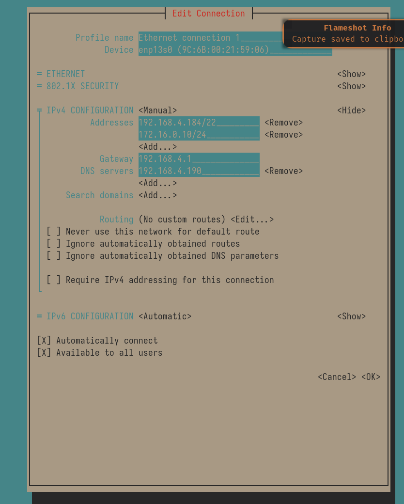

# Fortigate Firewall configuration 

## Fortigate Firewall Configuration

* Configured eero router DHCP/NAT seting to "bridge" mode 

* Remove internal5 & internal1 from hardware switch 

* Changed internal5 Alias to MGMT

* Changed internal5 role to DMZ

* Moved cable on fortigate internal5 to port 5 on dumb switch

* Added HTTPS , SSH , PING to Administrative Acess section for internal5 

* Configured IP/Network Mask 

* Enabled Device Detection on internal5 

* Added 172.16.0.10/24 with gateway of 172.16.0.254 on my local machine 
> sudo nmcli connection add type ethernet con-name fortigate-mgmt ifname enp13s0 ip4 172.16.0.10/24 gw4 172.16.0.254

* Removed HTTP , HTTPS , SSH from all ports except MGMT 

* Configured IP for DMZ interface to 0.0.0.0/0.0.0.0 

* Disabled DHCP server on DMZ interface 

* Changed DMZ interface to disabled 

* Configured addressing mode of WAN2 to "manual"

* Configured address on Wan2 interface to 0.0.0.0/0.0.0.0 

* Configured status of WAN2 to "disabled"

* Changed HTTPS port to 8765 in System -> Settings 

* Changed hostname to "buhfur-fortigate" in Settings 

* Changed gateway on eno1 connection on local host to "192.168.4.34"

* Created new IPv4 policy under Policy & Objects -> IPv4 Policy 

* Connected fortigate internal2 to port 4 on dumb switch 

* Created specific service for proxmox web ui and jellyyfin web ui 

* Changed services in Virtual Ip's from "ALL" to "proxmox-webui" and "jellyfin-webui" respectively 

## IPv4 Policy 

* Changed Name to "LAN to WAN "

* Set incoming interface to internal 

* Set outgoing interface to wan1 

* Set Source to "all" 

* Set Destination to "all"

* Schedule was pre-configured to "always"

* Set Service to "ALL"

* Action was pre-configured to "ACCEPT"

* NAT was already enabled 

* Added new virtual IP for proxmox server on fortigate 

* Added new virtual IP for jellyfin-reverse-proxy 

* Created new IPv4 policy for jellyfin-reverse proxy 

* Configured IPv4 policy for jellyfin-reverse-proxy to only allow http service 

## Port forwarding 

I believe I understand now why I was having issues connecting to my local hosts with forwarded ports. In the setup I was configuring the external IP to the public WAN IP given by my ISP. This was WRONG. The reason for this is that currently the fortigate is NOT acting as a DHCP server, relying on my router for that instead. Because of this the requests to forwarded ports using the public WAN IP went nowhere. 

- What I did to fix it 
    * Configured the External IP to the IP shown on my router for the fortigate. I forwarded the ports mapped on the fortigate to the private LAN IP shown on my local network. That way the requests will reach the public IP , which will then forward the requests matching the forwarded ports to the internal NAT IP ( 192.168.4.146 ) which will then be forwarded properly through the fortigate to their respective hosts. I've attached a screenshot of the configuration options I used to set all this up.

## Fixing local internet 

For some reason my router encounters issues when playing around with the DHCP settings. After disabling bridge mode my eero started showing the infamous red light

- Steps taken to resolve

* unplugged ONT cable from modem  

* Power cycled modem 

> Note : When I mean "modem" i'm talking about the eero router

## Accessing Fortigate webui using nmcli 

1. Open TUI 

2. edit existing ethernet connection 

3. Under addresses in IPv4 Configuration , Add an IP within the subnet of the WebUI's subnet , in this case , the IP configured for the WebUI is 172.16.0.254 , I added the 172.16.0.10/24 to the existing IP's. View the screenshot below of my current config shown in nmtui 

> Note: You don't need a separate gateway or additional route added to access the webui , all you need to do is add the internal IP in the same subnet as the webui. 

## Forwarding proxmox webui port to be accessible from outside network 

## Questions 

### Should I use the router for DHCP or the firewall ?

Generally this would be fine for smaller to mid size networks. For larger networks this may not be advantageous as this would put more load on the firewall. 

