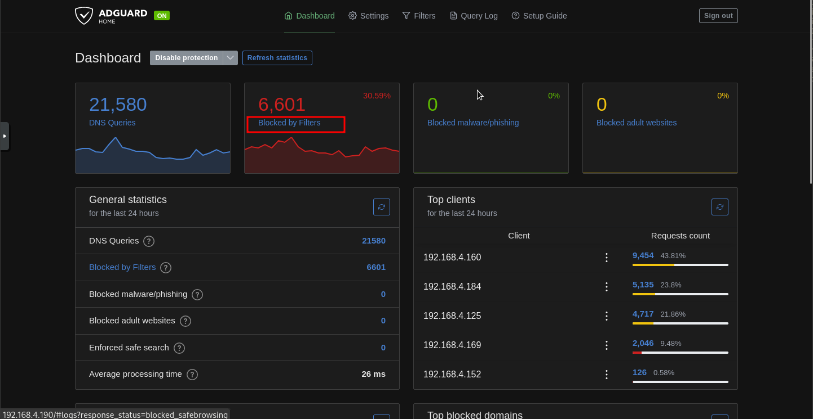
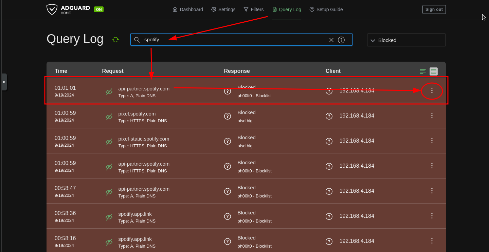

# Linux notes for reference

In this document I have added various bash snippets ,tips , and other useful pieces of knowledge that might help me navigate the insane POWAH of linux.

---

# Table of contents 

- [System Info](#system-info)
- [Command & Bash snippets](#command--bash-snippets)
- [System Tools and 3rd party utilities command snippets](#system-tools-and-3rd-party-utilities-command-snippets)
- [Xinitrc](#xinitrc)
- [Tips & tricks](#tips--tricks)
- [ProtonVPN connections](#protonvpn-connections)
- [Setting up torrent server vm](#setting-up-torrent-server-vm)
- [Redirect both STDOUT and STDERR](#redirect-both-stdout-and-stderr)
- [Piping](#piping)
- [Tar](#tar)
- [Systemd](#systemd)
- [xrandr](#xrandr)
- [Packet Capturing](#packet-capturing)
- [nmcli & Networking](#nmcli--networking)
- [SELinux](#selinux)
- [DNF](#dnf)
- [Adguard Home](#adguard-home)
- [Firewalld](#firewalld)
- [NFS](#nfs)
- [NTP](#ntp)
- [Podman](#podman)
- [User management](#user-management)
- [Package management with DNF](#package-management-with-dnf)
- [Logical Volume Management](#logical-volume-management)
- [CIFS](#cifs)
- [NMAP](#nmap)
- [GRUB](#grub)
- [Common errors and small fixes](#common-errors-and-small-fixes)
- [Docker](#docker)
- [Sed](#sed)
- [Oracle SBC](#oracle-sbc)
- [TrueNAS](#truenas)
- [Grep](#grep)
- [Find](#find)
- [System Clipboard](#system-clipboard)
- [Unzip](#unzip)
- [Display Management](#display-management)
- [Git](#git)
- [Xorg](#xorg)
- [Rclone](#rclone)
- [Du](#du)
- [Ranger](#ranger)
- [Markdown](#markdown)
- [Youtube downloading](#youtube-downloading)
- [Serial Communication](#serial-communication)
- [Jekyll](#jekyll)
- [ChatGPT CLI](#chatgpt-cli)  
- [Rust](#rust)
- [Zsh](#zsh)
    - [Installing Zsh](#installing-zsh)
- [Password encryption](#password-encryption)
# Package managers 

## Apt  

- Query PPA for packages 
    ```bash
    apt-cache search <package-name>
    ```
- Query PPA for NVIDIA package 
    ```bash
    apt-cache search nvidia
    ```


## RHEL 

To be continued 

--- 

# System info 

## Create drive for mounting usb using fdisk 

- For UEFI systems 
    * Partition Table : GPT 
    * Partition Type : EFI System Partition
    * Filesystem: FAT32 

- For BIOS systems 
    * Partition Table : MBR 
    * Partition Type : Primary 
    * Filesystem: FAT32 or ext4 (FAT32 preferred ) 

- For everything else 
    * Partition Table : MBR 
    * Partition Type : Primary 
    * Filesystem: FAT32 


    
## Downgrading kernel 

* Install Image, Headers , and generic Headers for the kernel version you are choosing 

* Install all 3 files , last time I was downgrading an ubuntu 24.04 distro using Kernel Version : 6.8.0-48-generic down to 5.8.5

* Update grub config 

## System Memory 

- Using /proc/meminfo  
    ```bash
    cat /proc/meminfo 
    ```

- Using free 
    ```bash
    free -h
    ```

- Using vmstat 
    ```bash
    vmstat -s
    ```
- Using dmidecode 
    ```bash
    sudo dmidecode -t memory 
    ```

- Using inxi 
    1. install inxi 
        ```bash
        sudo apt install inxi 
        ```
    2. Run following command 
        ```bash
        inxi -m 
        ```

## Swap files 

When setting up swap files , the size of the partition used for a swap file depends on the size of the host systems memory. 

* If your system has 2 GB or less , the swap file should be 2-4 times the amount of ram 

* If your system has 4-8 GB of ram , the swap file size only needs to be 1-2 times the amount of RAM 

* If your system has 8-16 GB of ram , the swap file size should be 0.5-1 times the amount of ram 

## UEFI & Legacy BIOS mode 

- Check if you're booted into UEFI using /sys/firmware 
    ```bash
    ls /sys/firmware/efi 
    ```
- Check if you're booted into UEFI using efibootmgr ( only works in UEFI mode )
    ```bash
    sudo efibootmgr
    ```

> Note: If you see any contents in the /sys/firmware/efi directory , then you will know you are currently using UEFI mode 


# Command & Bash snippets 


- Write iso image to usb 
    ```bash
    sudo dd if=/path/to/distro.iso of=/dev/sdX bs=4M status=progress oflag=sync
    ```
- Bash difference between $() and ${}

> "${}" : Used for referencing variables in a script 

    - Example 
        ```bash
        echo ${var} something
        ```

> "$()" : Used for running commands in a subshell 

    - Example 
        ```bash
        echo "Path $(basename /home/user/Downloads)
        ```


- Redirect both STDOUT and STDERR 

    ```bash
    command &> /dev/null
    ```

    ```bash
    command > /dev/null 2>&1
    ```

- Symbolic and hard links 
    ```bash
    ln -s TARGET LINK_NAME 
    ```
The best information can be found on the man page. Use man ln for further details. However, to avoid confusion, please note that the syntax is as follows: "TARGET" should be the file or directory for which you would like to create a link, while "LINK\_NAME" is the name and directory where the link will appear in the specified absolute file path. It should be noted that "TARGET" should be an absolute path to the item you want to link. However, you can use relative paths for "LINK\_NAME" if you wish. Nonetheless, I prefer using absolute paths for both to avoid making mistakes, such as misplacing the link on my system.

- Create symbolic link to file
    ```bash
    $ ln -s /home/ryan/something.py /opt/scripts/something.py
    ```
- Create directory with a timestamp as it's name
    ```bash
    timestamp=$(date +"%Y-%m-%d_%H-%M-%S")
    ```

    - Then to make the directory , use the following syntax 
        ```bash
        mkdir "directory_$(date +%Y%m%d_%H%M%S)"
        ```

- Enable vi keybinds for bash
    ```bash
    set -o vi 
    ```

- Find bash shortcuts
    ```bash
    man readline
    ```

- Remove file with hyphens in the name
    ```bash
    rm -- -filename

    rm ./--filename
    ```

- Start comand as background job
    ```bash
    command &
    ```

> Note: Type `jobs` to view your background tasks

- Resume suspended background 
    ```bash
    fg
    ```

- Change file extension of all files in directory
    ```bash
    rename 's/\.foo$/.bar/' *.foo
    ```

> Note: Replace "foo" with the current extension , replace "bar" with the new ext.


- Show keycode for keybind
    ```bash
    xev
    ``` 

> Note: If you're using Xorg as your display server, xev should already be installed. This tool let's you see what keycode goes to what key.

    - After finding the keycode, run this command below. Substitute \<KEYCODE\> with the numerical keycode you retrieve from xev.
        ```bash
        xmodmap -pk | grep <KEYCODE>
        ```

- Show info about hard drives connected
    ```bash
    find /dev/disk/by-id/ -type l|xargs -I{} ls -l {}|grep -v -E '[0-9]$' |sort -k11|cut -d' ' -f9,10,11,12
    ```

- Show otherboard info
    ```bash
    dmidecode -t 2 
    ```

- Disable trackpad on linux
    ```bash
    sudo apt-get install xinput 
    ```

    1. Find the name of your touchpad
        ```bash
        xinput list
        ```
> Note: Alot of the time trackpads are labeled with "SynPS/x Snynaptics TouchPad". 

    2. Locate the ID in the second column using the command below.
        ```bash
        xinput --disable <ID>
        ```


- List all users on host
    ```bash
    compgen -u | column
    ```


- Restore default .bashrc, .profile
    ```bash
    cat /etc/skel/[.bashrc,.profile,...] ~/.[bashrc,profile,etc...]
    ```

> Note: The default versions of these files are usually going to be stored in /etc/skel

- Show motherboard info
    ```bash
    dmidecode | less
    ```


- Get CPU info
    ```bash
    lscpu
    cat /proc/cpuinfo
    ```

- Get disk info
    ```bash
    lsblk -o +MODEL,SERIAL,WWN

    or

    ls -l /dev/disk/by-id

    or 

    lsblk |awk 'NR==1{print $0" DEVICE-ID(S)"}NR>1{dev=$1;printf $0" ";system("find /dev/disk/by-id -lname \"*"dev"\" -printf \" %p\"");print "";}'|grep -v -E 'part|lvm'
    ```


- Get UUID of drive 
    ```bash
    lsblk -f 

    or 

    sudo blkid

    or 

    vim /etc/fstab

    ```


- Reduce text entering sensitivity

    1. Enter this line in your xinitrc , or just copy the xinitrc from the ~/dotfiles directory to your local .xinitrc
        ```bash
        xset r rate 250 60
        ```

> Note: You can either use kbdrate or xset , preferably xset as it works alot easier.

This will reduce the sensitivity 

---

# System Tools and 3rd party utilities command snippets

The below section should include tools and snippets from various tools i've used.

## Minecraft 

- Download location for minecraft shader packs 

    - If you're using UltimMC , 
        `/home/$USER/UltimMC/instances/1.21.3/.minecraft/shaderpacks`
## Find 


- List files with specified extension
    ```bash
    find . -name \*.md
    ```

> Note: Replace "." with the directory you are searching in and replace "md" with the extension you are trying to search for. 

- Use find to only list dotfiles 
    ```bash
    find . -maxdepth 1 -type f -name ".*" 
    ```

- Change extensions of all files in dir
    ```bash
    find . -name '*.txt' -exec sh -c 'mv "$0" "${0%.txt}.txt_bak"' {} \;
    ```

> Note: Replace .txt with the current ext and replace .txt\_bak with the ext you are trying to set it to 

## Xinitrc 

> Note: The xinitrc file is used for loading additional configurations and settings when the Xorg server starts.


- Manually disable the caps lock ( lock , not the button itself) using python script 
    ```bash
    python -c 'from ctypes import *; X11 = cdll.LoadLibrary("libX11.so.6"); display = X11.XOpenDisplay(None); X11.XkbLockModifiers(display, c_uint(0x0100), c_uint(2), c_uint(0)); X11.XCloseDisplay(display)'
    ```

> Note: Install numlockx and run the command above 

- Using setxkbmap 
    ```bash
    setxkbmap -option caps:none
    ```
- Using localectl ( RHEL )
    ```bash
    sudo localectl set-x11-keymap us "" "" caps:none
    ```

- Using XKBOPTIONS ( Debian )
    1. Open /etc/default/keyboard
        ```bash
        vim /etc/default/keyboard
        ```
    2. Modify config file 
        ```bash
        XKBOPTIONS="caps:none"
        ```
    3. Apply changes
        ```bash
        sudo dpkg-reconfigure keyboard-configuration
        sudo udevadm trigger --subsystem-match=input --action=change
        ```

- Add aliases for ssh connections
    1. Open SSH config in vim 
        ```bash
        vim ~/.ssh/config 
        ```
    2. In your ssh config , add two lines for each host , one being the IP and the port you want to use 
        ```bash
        Host xxx.xxx.x.x

        Port xxx
        ```

    3. Then add the IP addresses for the ssh hosts to the /etc/hosts file with the format below 
        ```bash
        IPADDR     hostname
        ```


- Create swap file

    1. Use `dd` to create the file using the /dev/zero device
        ```bash
        dd if=/dev/zero of=/swapfile bs=1M count=100
        ```

    2. Convert file to swapfile
        ```bash
        mkswap /swapfile
        ```

    3. Swap to the newly created swap file
        ```bash
        swapon /swapfile
        ```

    4. Mount the file in /etc/fstab
        ```bash
        /swapfile none swap defaults 0 0
        ```

        > Add this line to the bottom of your /etc/fstab file. This will mount the swap file automatically after boot 

--- 


# Tips & tricks 

Below is some useful info for different services and how they can be enabled / modified.

- Installing Network Manager on Debian 12

One of the issues while installing NetworkManager lies with a preset network configuration by the system. Specifically the file /etc/network/interfaces is configured automatically and for some reason if this is present you will see an error in STDERR when installing asking you to remove the configuration if you want to use Network manager to manage any connections.


Simply delete all lines in /etc/network/interfaces and re-install the package and the systemd service file should be present and should allow you  to activate it. 

# ProtonVPN connections 

> Note: When using the pre-built OpenVPN configurations , change the file extension to a .conf file , then copy the file over to /etc/openvpn. This will start a daemon for every connection in the directory.

- Setting up torrent server vm 

    1. Put ovpn file in /etc/openvpn 

    2. install openvpn-systemd-resolved and network manager
        ```bash
        sudo apt install openvpn-systemd-resolved
        ```

- Piping Reference

> 0> = STDIN
>
> 1> = STDOUT 
> 
> &> = STDOUT & STDERR
> 
> 2> = STDERR


# Tar

- Archive top level directories with tar
    ```bash
    sudo tar czf interfaces.tar -C / etc/network/interfaces
    ```

- Restore backup from drive
    ```bash
    tar --overwrite -xzvf backup.tar.gz --directory /
    ```

- List contents of archive
    ```bash
    tar -tf archive.tar
    ```

- Add file to archive
    ```bash
    tar -rf backup.tar file
    ```

- Backup entire system with timestamp
    ```bash
    tar pzvxf --exclude=mnt/ --exclude=sys/ --exclude=proc/ /backup/"$(date '+%Y-%m-%d').tar.gz" --one-file-system /
    ```

> Note : it's a good idea to exclude sys, mnt , and proc as they can cause a backup to freeze. None of these directories should be necessary for archival anyways 

- Add timestamp to tar archive
    ```bash
    tar -zcvf "$(date '+%Y-%m-%d').tar.gz" 
    ```

- Extract tar archive to specific directory
    ```bash
    tar -xf archive.tar -C /path/to/extract/to
    ```

- Extract specific file from archive( Example)
    1. (Optional) List contents of archive 
        ```bash
        tar -tf archive.tar
        ```
    2. Extract file using path from output 
        ```bash
        tar -xf archive.tar /path/in/archive/to/file
        ```


---

# Systemd 


-  Stop the service 
    ```bash
    systemctl stop <unit-name> 
    ```
 
-  Disable unit 
    ```bash
    systemctl disable <unit-name>
    ```

-  Stop the unit from being started manually or automatically 
    ```bash
    systemctl mask <unit-name>
    ```


- Systemd timer unit template
    ```bash
    [Unit]
    Description=Runs My Service every hour

    [Timer]
    OnBootSec=10min
    OnUnitActiveSec=1h
    Unit=my-service.service

    [Install]
    WantedBy=timers.target

    ```

- List all Systemd timers 
    ```bash
    systemctl list-timers --all
    ```

- Check when Systemd timer will go off
    ```bash
    systemctl status timer-name.timer
    ```
> Note: After running this command , you should see a "Trigger" section in the output. This field tells you when the timer will go off next.

- Configure unit to run command when stopping / exiting 
    ```bash
    
    ExecStop=/path/to/command
    ```

> Note: Put this snippet under the "Service" section 

- Creating service files that involve X org server
    ```bash
    PartOf=graphical-session.target
    ```

> If you need to create a service that depends upon an X server running , add this line under the "Unit" section. Also you will want to add this line under the "Install" section.

- Config for unit which requires X server to be running 
    ```bash
    WantedBy=xsession.target
    ```

- Boot into different target
    1. Search for all targets you can boot into 
        ```bash
        cd /usr/lib/systemd/system

        grep Isolate *.target
        ```

    2. Decide which target you would like to use , then run systemctl isolate 
        ```bash
        systemctl isolate something.target
        ```

- Start systemd service under specific User ID
    ```bash
    systemctl --user service.name
    ```

- Change user systemd service to start on system startup
    ```bash
    loginctl enable-linger myuser
    ```

## Running scripts at startup


- Using Rc.local
    ```bash
    sh /home/user/scriptdir/script.sh
    ```

> Add the line above in the /etc/rc.d/rc.local file 

- Using  Systemd unit file 
    ```bash
    [Unit]
    Description=Reboot message systemd service.

    [Service]
    Type=simple
    ExecStart=/bin/bash /home/ec2-user/reboot_message.sh

    [Install]
    WantedBy=multi-user.target
    ```
> Use the template above for your script , put this inside */etc/systemd/system*

- Set perms for the service file 
    ```bash
    chmod 644 /etc/systemd/system/script.service 
    ```

- Enable the service file in systemd 
    ```bash
    systemctl enable script.service 
    ```


- Using Crontab 

1. Edit the crontab file 
    ```bash
    crontab -e 
    ```

2. Configure crontab to run script on reboot 
    ```bash
    @reboot sh /home/user/reboot_message.sh
    ```

> Note: To run the script on reboot, paste the following snippet and replace the "/home/user/reboot\_message.sh" with the path of your scripts. Please note that not all versions of cron support the '@reboot' option

- Using init.d 

1. Make a script and put it in /etc/init.d/ Use the template below : 

    ```bash
    !/bin/sh
    case "$1" in
      start)
        # Executes our script
        sudo sh /home/user/script.sh
        ;;
      *)
        ;;
    esac
    exit 0
    ```

---

# Xrandr 

- Configuration 

> Note: Put xrandr configurations in ~/.xprofile 

- Move monitor to the right of another 
    ```bash
    xrandr --output <DISPLAY-OUTPUT-1> --right-of <DISPLAY-TWO-2> 
    ```

> Note : if you're unsure which display output to use, run the `xrandr` command once to see all available displays to choose


- Change refresh rate of monitor 
    ```bash
    xrandr --output <DISPLAY-OUTPUT> --mode <DISPLAY-RESOLUTION> --rate <REF-RATE> 
    ```

> Note: Put this line in the ~/.xprofile file for configuration on startup ( happens late in the boot process ) 


- Change background picture with feh 

    1. Set wallpaper with Feh 
        ```bash
        feh --bg-fill /home/user/something.jpg
        ```

    2. Then put this line in your ~/.xinitrc file 
        ```bash
        ~/.fehbg &
        ```

> Note: create a ~/.fehbg file with your feh command 


# nmcli & Networking 

- Check for openports 
    ```bash
    netstat -tulnp

    ss -tulnp 
    ```

- Change subnet mask of existing connection using nmcli 

- Bring up interface manually using ip tool
    ```bash
    sudo ip link <interface> up 
    ```
- Show service being used by specific port
    ```bash
    lsof -i tcp:80

    lsof -i :80
    ```

> Note: This example prints out processes using the "80" port which is commonly used for HTTP

- Remove Secondary IP for host
    ```bash
    nmcli con mod <con-name> -ipv4.addresses "<IP>" 
    ```
- Add Wifi Connection
    ```bash
    nmcli device wifi connect <AP name> password <password>
    ```

- Create new network connection in nmcli
    ```bash
    nmcli con add con-name static ifname ens18 autoconnect no type ethernet ip4 10.0.0.10/24 gw4 10.0.0.1 ipv4.method manual
    ```

- Bring up network connection with nmcli
    ```bash
    nmcli con up <con-name> 
    ```

- Switch to DHCP with nmcli
    ```bash
    nmcli con up dhcp
    ```

- Change connection to not connect automatically with nmcli
    ```bash
    nmcli con mod <con-name> connection.autoconnect no
    ```

- Add DNS server to connection with nmcli
    ```bash
    nmcli con mod <con-name> ipv4.dns <dns-server-ip>
    ```

- To add additional dns servers
    ```bash
    nmcli con mod <con-name> +ipv4.dns 8.8.8.8
    ```

- Change IP for existing connection in nmcli
    ```bash
    nmcli con mod <con-name> ipv4.addresses <ip-address>/<CIDR-prefix>
    ```

- Add secondary IP addresses with nmcli
    ```bash
    nmcli con mod <con-name> +ipv4.addresses <new-ip>/<CIDR-prefix>
    ```

- After chaning any properties to a connection you must re-activate the connection
    ```bash
    nmcli con up <con-name> 
    ```

---

# Packet Capturing 

## Tshark 

- Capture traffic on specified interface 
    ```bash
    tshark -i <interface> 
    ```
- Capture & Save traffic on specified interface to a file
    ```bash
    tshark -i <interface> -w capture.pcap
    ```
- View capture from file 
    ```bash
    tshark -r capture.pcap
    ```
- Search for specific port in capture 
    ```bash
    tshark -r path_to_file.pcap -Y "tcp.port == 6881 || tcp.port == 6889 || tcp.port == 51413"
    ```

## TCPDUMP

- Search for specific port in capture 
    ```bash
    sudo tcpdump -r path_to_file.pcap 'tcp port 6881 or tcp port 6889 or tcp port 51413'
    ```

    To specify a port range 

    ```bash
    sudo tcpdump -r path_to_file.pcap 'tcp portrange 6881-6991'
    ```

- Check if Wake-on-LAN port is open 
    ```bash
    tcpdump -i <interface-name> udp port 9 
    ```

---

# SELinux 

- Put SElinux into disabled mode in grub
    ```bash
    selinux=0
    ```

> Note: Put this line into your kernel boot args 

- Put Selinux into enforcing mode in grub
    ```bash
    enforcing=0
    ```

> Note: Add this to kernel boot args 


- View selinux config
    ```bash
    cat /etc/sysconfig/selinux
    ```

- Check what mode selinux is running
    ```bash
    getenforce
    ```

- Switch between selinux modes temporarily

    - permissive mode
        ```bash
        setenforce 0
        ```

    - enforcingm mode
        ```bash
        setenforce 1
        ```

- Switch modes persistantl

> Note: Modify /etc/sysconfig or add kernel boot arg 

    - Get status of selinux
        ```bash
        sestatus
        ```


- Get selinux status 
    ```bash
    setstatus -v
    ```

- Show context setttings

    - using ls
        ```bash
        ls -Z
        ```

    - using ps
        ```bash
        ps Zaux
        ```

    - using ss
        ```bash
        ss -Ztul
        ```

- Setting Context types

    - Add context type to manually created directories
        ```bash
        semanage fcontext -a -t <contxt-type> "/mydir"
        ```

    - Apply policy settings
        ```bash
        restorecon -R -v /mydir
        ```

- Help with setting contexts
    ```bash
    man semanage-fcontext
    ```


- Finding context types
    ```bash
    dnf -y install selinux-policy-package

    man -k _selinux
    ```

> Note: Install selinux-policy-doc package 

- Enable ssh port in SELinux
    ```bash
    semanage port -a -t ssh_port_t -p tcp PORTNUMBER 
    ```

- Relabel entire filesytem
    ```bash
    restorecon -Rv /
    ```
    - Create .autorelabel after modifications
        ```bash
        /.autorelabel
        ```

> Note: This works after server restart, afterwards the file will be removed

- Managing Port Access

    - Example: Changing port of apache
        ```bash
        semanage port -a -t http_port_t -p tcp 8008
        ```

    - Template
        ```bash
        semanage port -a -t <context-type> -p <tcp/udp> <port>
        ```


> Note: Run `restorecon` when finished to apply changes.


- Using Boolean Settings to Modify SELinux Settings

    - Get list of booleans on system
        ```bash
        getsebool -a

        semanage boolean -l
        ```

    - Change Boolean example
        ```bash
        setsebool ftpd_anon_write on
        ```

    - Template
        ```bash
        setsebool <context-rule> <on/off>
        ```

- Apply permanant changes to boolean
    ```bash
    setsebool -P
    ```

- Diagnosing and Addressing SELinux Policy Violations

    - audit log

> Note: The audit log is stored in /var/log/audit/audit.log.Messages are logged with the type=AVC in the log.You can search for these messages through grep 

- Search audit messages in Grep 
    ```bash
    grep AVC /var/log/audit/audit.log
    ```

> Note: "avc: denied { map } " indicates a map request was denied , therefore some process tried to read attributes of a file and that was denied. Thus triggering a policy violation. In this logging , the scontext is the **source context** while the tcontext is the **target context**

- Making SELinux Analyzing Easier

    - Download the **sealert** command 
        ```bash
        dnf -y install setroubleshoot-server
        ```

> Note: Once finished downloading ,restart your server.Then you can grep for entries from sealert.

- Grep for sealert entries 
    ```bash
    journalctl | grep sealert
    ```

> Note: From the info you get , you might see a command it recommends to run to see further info. 

- Check sealert logging 
    ```bash
    sealert -l <SOME-ID> 
    ```

> Note: Sometimes the logging will even recommend other commands to run in order to fix the issue, take these commands with a grain of salt unless you know what you are doing .These recommendations will have a confidence score 


- Key topics about selinux

    * newly created files inherit the context settings from the parent directory

    * copied files do this as well. 

---

# DNF 

- Search for RPM's of specific tool
    ```bash
    dnf whatprovides */semanage

    dnf whatprovides
    ```

- Undo recent download 
    ```bash
    dnf history undo <ID> 
    ```

---

# Adguard Home

- Error: "X" Service is blocked !

    1. Log onto your adguard home page and click on the Blocked by Filters button 



    2. Then search for the domain you would like to block 



    3. Select the side menu on the right hand side and click "Unblock"


**And after that you're done !**

---

# Firewalld 

- View all available services
    ```bash
    firewall-cmd --get-services
    ```

- Get default zone
    ```bash
    firewall-cmd --get-default-zone
    ```

- Get available zones
    ```bash
    firewall-cmd --get-zones
    ```

- View all ports for specific zone ( with formatted output ) 
    ```bash
    firewall-cmd --zone=<zone-name> --list-ports | tr ' ' '\n' | column
    ```

- List services
    ```bash
    firewall-cmd --list-services
    ```

- List services enabled in zone
    ```bash
    firewall-cmd --list-all --zone=public
    ```

- Add port to firewalld permanently
    ```bash
    firewall-cmd --add-port=2020/tcp --permanent
    ```

- Add service to firewalld
    ```bash
    firewall-cmd --add-service=vnc-server --permanent
    ```

- Reload firewalld
    ```bash
    firewall-cmd --reload
    ```

- Write configs to runtime
    ```bash
    firewall-cmd --runtime-to-permanent
    ```

- Add source IP
    ```bash
    firewall-cmd --add-source=<ipaddress/netmask>
    ```


---

# NFS 

- Setup NFS on RHEL 9
    1. Create nfs directory to be shared 
        ```bash
        mkdir -p /nfsdata /users/user1 /users/user2
        ```
    2. Create /etc/exports file and assign the following 
        ```bash
        /nfsdata *(rw,no_root_squash)
        /users *(rw,no_root_squash)
        ```

    3. Install the cifs-utils package
        ```bash
        dnf install -y nfs-utils
        ```

    4. Add the nfs , rcp-bind, and mountd services to firewall 
        ```bash
        firewall-cmd --add-service nfs --permanent ; firewall-cmd --add-service rpc-bind ; firewall-cmd --add-service mountd --permanent
        ```

    5. Then reload the firewall-cmd config 
        ```bash
        firewall-cmd --reload
        ```

- List available mounts from IP or hostname
    ```bash
    showmount -e <IP-or-hostname>
    ```

- Perform pseudo root mount
    ```bash
    mount <Ip-Or-hostname>:/ /mnt
    ```

---

# NTP

- Turn on NTP
    ```bash
    timedatectl set-ntp 1
    ```


- Convert epoch time to human time
    ```bash
    date --date '@1720893005
    ``` 

- Show the current system day of month, month , and year
    ```bash
    date +%d-%m-%y
    ```

- Set the current time 3 minutes past 4 pm
    ```bash
    date -s 16:03
    ```

- Synchronize curent system time to the hardware clock 
    ```bash
    hwclock --systohc
    ``` 

- Synchronize current hardware time to the system clock
    ```bash
    hwclock --hctosys
    ``` 


- Show current time settings 
    ```bash
    status
    ``` 
- Set current time 
    ```bash
    set-time TIME
    ``` 

- Set timezone
    ```bash
    set-timezone ZONE
    ```

- Show a list of all time zones 
    ```bash
    list-timezone
    ```  
- Control whether to use RTC ( hardware clock )
    ```bash
    set-local-rtc [0|1]
    ``` 

- Control whether NTP is enabled
    ```bash
    set-ntp [0|1]
    ```

> Note: timedatectl is used to switch on NTP time , it talks to the chronyd process

---

# Podman

- Run container in detached mode
    ```bash
    podman run -d nginx
    ```

- Run container in TTY mode
    ```bash
    podman run -it nginx /bin/sh
    ```

- View running containers
    ```bash
    podman ps
    ```

- View all inactive and active containers
    ```bash
    podman ps -a
    ```

- Attach to running container
    ```bash
    podman attach <name>
    ```

- Stop running container
    ```bash
    podman stop <name>
    ```

- Search which registries are currently used
    ```bash
    podman info
    ```

- Filter images in search
    ```bash
    podman search --filter official=true alpine

    or 

    podman search --filter stars=5 alpine
    ```

- Pull image
    ```bash
    podman pull <image>
    ```


- Build custom image
    ```bash
    podman build -t imagename:tag -f /path/to/Containerfile
    ```

    - Example  
        ```bash
        podman build -t mymap:1.0
        ```


- Verify custom image was built
    ```bash
    podman images
    ```

- Remove images with None tag
    ```bash
    podman image prune
    ```


- Send SIGTERM signal to the container , 
        ```bash
        podman stop
        ``` 

> Note : If no results after 10 seconds , the SIGKILL signal is sent.

- Kill container
    ```bash
    podman kill
    ``` 

> Note: Immediately sends the SIGKILL command 

- Restart container
    ```bash
    podman restart
    ``` 

- Remove container
    ```bash
    podman rm
    ``` 

> Note: Removes container files written to the writable layer 

- Run container and delete container files automatically 
    ```bash
    podman run --rm
    ``` 

- Running Commands inside containers
    ```bash
    podman exec mycontainer uname -r
    ```

    - TTY MODE
        ```bash
        podman exec -it mycontainer /bin/bash
        ```

- Managing Container Ports


```bash
podman run --name nginxport -d -p 8080:80 nginx
```

> Note: Ports 1-1024 are accessible by the root user only. To run a container with port forwarding , run the following command below. This would allow the nginx process to access host port 8080 and forward to standard http port 80 .**After adding the port , don't forget to add the port to your firewall**

- Managing Container Environment Variables

For containers such as mariadb , you will need to supply the container with environment variables. For example the mariadb container needs the password for the root user.

Some containers contain a "usage" line that may say how the container needs to run with environment variables included. However this is not always the case, you can check the container with `podman inspect` to see if it's there.


    - Mariadb container example
        ```bash
        podman run -d -e MYSQL_ROOT_PASSWORD=password -e MYSQL_USER=anna 
        ```

- Managing Container storage

> Note: If you want to save the changes made in the writable layer , you will need to configure persistant storage.
> You can do this by adding a bind-mount from the host OS into the container, this is used instead of a block device 

> There are 2 requirements to doing this however : 
> * The host directory must be writable for the user account that runs the container
> * The appropriate SELinux context label must be set to container\_file\_t
>
> Note: The bind-mount dir must be OWNED by the user that runs the container.

    - Configure bind mount to be owned by running user
        ```bash
        semanage fcontext -a -t container_file_t "hostdir(/.*)?"; restorecon
        ```

        - To do so automatically
            ```bash
            -v host_dir:container_dir
            ```

    - If root container or if user is owner of the container 
        ```bash
        -v host_dir:container_dir:Z
        ```


- Set directory ownership on bind-mounted directories for rootless containers

    1. Find UID of the user that runs the container main app
        ```bash
        podman inspect imagename
        ```

    2. set the container UID as the owner of the directory on the host
        ```bash
        podman unshare chown nn:nn dirname
        ```

> Note: To set the container UID as the owner of the directory on the host. This directory must be in the rootless user home dir. Otherwise it woulden't be apart of the user namespace.

    3. Verify the user ID mapping 
        ```bash
        podman unshare /cat/proc/self/uid_map
        ```  

    4. Verify that the mapped user is owner on the host
        ```bash
        ls -ld ~/dirname
        ```


- Running Containers as Systemd Services

    1. Generate Systemd unit for container
        ```bash
        podman generate systemd --name mycontainer --files
        ```

    2.  Create this dir and CD to it, then run 
        ```bash
        podman generate
        ``` 
    3. Enable container as Systemd service 
        ```bash
        systemctl --user enable containe-mycontainer.service
        ```

> Note: The Container file must be generated in the `~/.config/systemd/user/directory`


---

# Package management with DNF 

- Add installation disk as repo
    1. Add repo file using config-maanger
    ```bash
    dnf config-manager --add-repo=file:///repo/filename
    ```

    2. Then locate the repo in /etc/yum.conf.d

    3. add the 'gpgcheck=0' to the file

---

# Logical Volume Managment 

- View volume groups extent size
    ```bash
    vgdisplay
    ```

- Create VG with specified extent size
    ```bash
    vgcreate myvg /dev/sdx -s 8MiB
    ```

> Note: The example above creates a volume group with a Physical Extent size of 8-MiB


- Create logical volume with specific size
    ```bash
    lvcreate -n lvdata -l 50%FREE vgdata

    or 

    lvcreate -n lvdata 
    ```

---

# CIFS 

- Enable CIFS mounts for user

    -  Set the SUID perm on these binaries [ /bin/mount, /bin/umount ,/user/sbin/mount.cifs ]
        ```bash
        sudo chmod u+s /bin/mount /bin/umount /usr/sbin/mount.cifs
        ```

- CIFS default ports

> CIFS uses ports 138 for clients , 139 & 445 for servers

---

# NMAP 

- Scan for all IP's on your network with nmap
    ```bash
    nmap -sn 192.168.0.0/24
    ```

> Note: You can substitute the ip in the command above for one or multiple networks 
> The '-sn' option tells nmap to not search for open ports 

- Check if certain port is open
    ```bash
    nmap <ip><prefix> -p <port-number>
    ```


    - If you know the port the service might be using
        ```bash
        lsof -i :<port>
        ```

    - Using Netstat
        ```bash
        sudo netstat -nlp  | grep <port-number>
        ```

---

# GRUB 

- Re-add windows to grub 2 boot menu 
- Enable os-prober
    1. Open grub config on local host 
        ```bash
        sudo vim /etc/default/grub
        ```
    2. Add the following line to the end of the file 
        ```bash
        GRUB_DISABLE_OS_PROBER=false
        ```
    3. Once you are done , update grub config ( Ubuntu )
        ```bash
        sudo update-grub
        ```
- Error : "Unable to mount root fs on unknown block"

1. Check grub config for image 
Check the configuration of the target in the grub menu , if the root filesystem is pointed to a "/dev/sda" drive,  this is likely the issue. In general you want to use UUID's as they are hard coded identifiers for each specific drive. 

2. Update GRUB config

Find the UUID of the drive where your root filesystem is mounted, add this UUID into your grub config under "GRUB\_CMDLINE\_LINUX\_DEFAULT" or "GRUB\_CMDLINE\_LINUX". Replace the value within with the UUID of the drive.


> Note : os-prober is disabled by default on ubuntu for security, this is most likely why your grub is not showing your windows installation if you're dual booting. 

- Reset root password without access to wheel group

    1. Boot into GRUB boot args 

    2. Remove the "rhgb" and "quiet" from the options 

    3. add "init=/bin/bash"

    4. then mount the filesystem as writable 
        ```bash
        mount -o remount,rw /
        ```

    5. Then change the password for root with 
        ```bash
        passwd root
        ```

    6. Then enable SELinux relabeling on next boot 
        ```bash
        touch /.autorelabel
        ```

    7. then reboot the system
        ```bash
        /usr/sbin/reboot -f 
        ```

# User management 

- View user ID
    ```bash
    id -u <username>
    ```

- Change password validity to 90 days
    ```bash
    passwd -n 30 -w 3 -x 90 username
    ```

- Change password validity to 90 days using chage
    ```bash
    chage -E 2025-12-31 username
    ```

> Note: The "-n" sets minimal usage period 
> "-w" sets the days the user will be warned before their password expires 
> "-x" sets the amount of days until the password expires 
> You can also do this with chage by setting an exact date 

- find the amount of days until the password expires 
    ```bash
    chage -l username
    ``` 
> Note: You can also do the same by viewing the /etc/passwd file 

- Change default password expiration

    1. open the **/etc/login.defs** file 

    2. change PASS\_MAX\_DAYS to the number of days before the password expires 


- Add default directories for newly created users
    1. Cd to /etc/skel directory 
        ```bash
        cd /etc/skel
        ```

    2. Modify the .bashrc file in /etc/skel

> Note: This bashrc will now be used for all created users

- Change default UUID for new users

    1. Open /etc/login.defs

    2. Locate and modify the two lines below
        ```bash
        UID_MIN 1000

        UID_MAX 60000
        ```


- View what groups a user is apart of
    ```bash
    lid username
    ```

- Change home directory of user with usermod
    ```bash
    usermod -d /home/NEW-DIR/ *username* 

    or

    usermod -m -d /home/NEW-DIR/ *username* 
    ```

> Note: You can use the `-m` option to move the contents of the users current home directory to the newly created home directory.


- Add user to group
    ```bash
    usermod -aG <group-name> <username>
    ```

- Change UID of user
    ```bash
    usermod -u <NEWUID> username
    ```

- Configure user to be unable to start interactive shell
    ```bash
    usermod -s /sbin/nologin username
    ```


- Change group owner of dir
    ```bash
    chown -R :groupname /dirname
    ```

- Change permissions for group on dir
    ```bash
    chmod g+rwx /dirname
    ```

> Note: This example allows full access to the dir for the group members 


- Configure dir where new files are owned by group

    1. Set the SGID on the directory 
        ```bash
        chmod g+s /dir
        ```
> Note: This change configures `/dir` to assign all newly created files to the group of the user 

- Change username of user
    ```bash
    usermod -l [new_user] [old_user]

    or 

    sudo usermod -l faruk -d /home/faruk -m pardus
    ```

- Update GRUB config
    ```bash
    grub2-mkconfig -o /boot/grub2/grub.cfg

    grub2-mkconfig -o /boot/efi/EFI/almalinux/grub.cfg

    grub2-mkconfig -o /boot/efi/EFI/redhat/grub.cfg
    ```


- Reset root password


1. Add init=/bin/sh in GRUB kernel boot args 

2. Remount filesystem for writing 
    ```bash
    mount -rw -o remount /
    ```

3. Use passwd to change pass 
    ```bash
    passwd root
    ```

4. Create autolabel file 
    ```bash
    touch /.autorelabel
    ```

## Common errors and small fixes 

- Error: org.bluz.Error.NotReady

    - Using the rfkill tool 
        ```bash
        sudo rfkill unblock all
        ```

---

# Docker 

- Connect docker container to network 
    ```bash
    docker network connect <network-name> <container-name-or-id>
    ```
- View docker network configuration 

    ```bash
    docker network inspect <container-id-or-name>
    ```

- Create docker network 
    ```bash
    docker network create <network-name>
    ```


- Re-Attach to docker container
    ```bash
    docker attach <container-id-or-name>
    ```

- Attach with bash TTY 
    ```bash
    docker exec -it <container-id-or-name> /bin/bash
    ```
    > to detach , press CTRL + P followed by CTRL + Q

- Change configuration of apache web container
    ```bash
    ```

- list docker networks

```bash
sudo docker network ls
```

- delete all docker containers

```bash
docker rm vf $(docker ps -a -q)
```

-  Add bind mount to docker container
    ```bash
    docker run -v /var/something/something:/var/container/something something  
    ```
> You can use the "-v" option when making bind mounts 
> the left operand is the file path of a directory on your local machine , the other operand is where that path will be mounted to in the containers file system

- Stop Docker compose run ( in parent directory )
    ```bash
    docker compose down 
    ```
- Stop specified docker compose run 
   ```bash
   docker compose -f /path/to/compose.yml down 
   ``` 
- Connect container to protonvpn container using Docker Compose 
In your compose.yml file , add the following 

- Start bash TTY in container 
    ```bash
    docker exec -it <container-id> /bin/bash
    ```
---

# Sed 


- Add text to specific line with sed 
    ```bash
    sed -e '/auth-user-pass/ s/$/ \/opt\/scripts\/login.conf/' ./*
    ```

- Replace /bin/sh with /bin/bash for all files in a dir
    ```bash
    sed -i 's/\#!\/bin\/sh/\#!\/bin\/bash/g' *
    ```


--- 

# Oracle SBC 

- Show all sip agents
    ```bash
    sho sipd agents
    ```

- Show configuration for specified agent
    ```bash
    sho configuration session-agent <AGENT-NAME> sh 
    ```

---

# TrueNAS

- Restart ssh service
    ```bash
    midclt call service.restart "ssh"
    ```

---

# Grep 

- Grep for specific file extension
    ```bash
    grep ".*\.md
    ```

> Note: Replace "md" with whichever extension you are trying to grep for.

- Grep for certain word in entire directory
    ```bash
    grep -rni "string" * 
    ```


---

# Unzip 

**unzip all zip files in directory**

```bash
unzip \*.zip
```


---

# Display Management 

**check what display manager you are using**

On Debian/Ubuntu using X11 : 

```bash
cat /etc/X11/default-display-manager
```

or 

```bash
dpkg -l | grep -E 'gnome|kde|xfce|lxde|mate'
```

On Redhat : 

```bash
cat /etc/sysconfig/desktop
```

```bash
rpm -qa | grep -E 'gnome|kde|xfce|lxde|mate'
```

Check current display session: 

```bash
echo $DESKTOP_SESSION
```

Check process list for running DE : 

```bash
ps -e | grep -E 'gnome|kde|xfce|lxde|mate'
```

**check what compositor you are using**

```bash
sudo apt install -y inxi
```

```bash
inxi -Gxx | grep compositor
```

--- 

# Git 

- Get upstream URL for local branch 
    ```bash
    git rev-parse --abbrev-ref --symbolic-full-name @{u}
    ```
- Get remote branches from git repo 
    ```bash
    git ls-remote --heads <repo-url>
    ```
- Clone specifc remote branch to local 
    ```bash
    git clone -b branch-name <repo-url>
    ```
- Delete remote branch on local machine 
    ```bash
    git push origin --delete branch-name 
    ```
- Create new local branch and add to remote 
    ```bash
    git checkout -b <branch-name> 
    git branch -u origin <branch-name>
    git push -u origin <branch-name> 
    ```
- Change URL used for "origin" remote 
    ```bash
    git remote set-url origin <link-here> 
    ```
- Ignore vim swap files
    ```bash
    *~
    ```

> Note: Add this to your .gitignore and commit changes 

- Cache ( store ) git credentials 
    ```bash
    git config credential.helper store
    ```

- Reset all changes made on branch to HEAD
    ```bash
    git reset --hard HEAD
    ```

# Xorg 

**Make desktop shortcut for application**


If you're on GNOME , you can make a shortcut using the gnome-desktop-item-edit tool 

```bash
gnome-desktop-item-edit ~/.local/share/applicationsj --create-new 
```


> You will need to do this if you would like the application to show up in the GNOME search menu. 

Create a file for the shortcut located in /usr/share/applications. Create file with \*.desktop extension 

Use the template below to create your shortcut 

Or you can do it manually by using this template for the \*.desktop file 

```bash
[Deskktop Entry]
Encoding=UTF-8
Version=1.0                                     # version of an app.
Name[en_US]=yEd                                 # name of an app.
GenericName=GUI Port Scanner                    # longer name of an app.
Exec=java -jar /opt/yed-3.11.1/yed.jar          # command used to launch an app.
Terminal=false                                  # whether an app requires to be run in a terminal.
Icon[en_US]=/opt/yed-3.11.1/icons/yicon32.png   # location of icon file.
Type=Application                                # type.
Categories=Application;Network;Security;        # categories in which this app should be listed.
Comment[en_US]=yEd Graph Editor                 # comment which appears as a tooltip.
```


**disable sleep / suspend on xorg**

Create the /etc/systemd/sleep.conf.d/nosuspend.conf file 

Add these lines to the file 

```bash
[Sleep]
AllowSuspend=no
AllowHibernation=no
AllowSuspendThenHibernate=no
AllowHybridSleep=no

```


---
> create 
> ```bash
> /etc/X11/xorg.conf.d/10-extensions.conf
> ```

Then put this into the conf file 

```
Section "Extensions"
    Option "DPMS" "false"
    EndSection

```


# Rclone 

**copy files from source to dest**

```bash
rlcone copy /source/dir mydrive:/drive/dir
```

--- 

# Du 

> **show all files in current directory size in different units**
> The 3 lines below shows the sizes in kilobytes 
>
> ```bash
du -k * 
> ```
>
> ```bash
> du --block-size=1K * 
> ```
>
> ```bash
> du -B 1K *
> ```
>
> # Note
>
> - You can substitute the 'k' for other letters which represent other file size units : M,K,G,T,E,Z,Y
>
> 

- List largest files in current directory

```bash
du . | sort -nr | head -n10
```

- List largest directories in current directory

```bash
du -s * | sort -nr | head -n10
```

- List disk size of all dotfiles 
    ```bash
    du -sh .??*
    ```
- Exclude files below a certain size threshhold 
    ```bash
    du -t 1K
    ```
- Exclude files above a certain size threshhold 
    ```bash
    du -t -1K
    ```

> Note : Read the Du manual under the SIZE section for valid formats for the threshhold size

---

# Ranger

**hidden files config**

> Open up ~/.config/ranger/rc.conf ( or where ever your config file is located )
> 
> # Add this line :
> 
> ```bash
> set show_hidden true 
> ```


---

# Markdown 

**Markdown table template**

```
| Left Align (default) | Center Align | Right Align |
| :------------------- | :----------: | ----------: |
| React.js             | Node.js      | MySQL       |
| Next.js              | Express      | MongoDB     |
| Vue.js               | Nest.js      | Redis       |

```

Output : 


| Left Align (default) | Center Align | Right Align |
| :------------------- | :----------: | ----------: |
| React.js             | Node.js      | MySQL       |
| Next.js              | Express      | MongoDB     |
| Vue.js               | Nest.js      | Redis       |

---

# Youtube downloading 

**download only the transcript**

```bash
yt-dlp --verbose --skip-download --write-subs --write-auto-subs --sub-lang en --sub-format ttml --convert-subs srt --output "transcript.%(ext)s" <PUT-URL-HERE> && sed -i '' -e '/^[0-9][0-9]:[0-9][0-9]:[0-9][0-9].[0-9][0-9][0-9] --> [0-9][0-9]:[0-9][0-9]:[0-9][0-9].[0-9][0-9][0-9]$/d' -e '/^[[:digit:]]\{1,3\}$/d' -e 's/<[^>]*>//g' ./transcript.en.srt && sed -e 's/<[^>]*>//g' -e '/^[[:space:]]*$/d' transcript.en.srt > output.txt && rm transcript.en.srt
```


---

# Serial Communication

- No /dev/ttyUSBx showing for connected serial cable 
    1. Check if proper drivers are loaded 
        ```bash
        lsmod | grep -E 'ch341|ftdi_sio'
        ```
    2. If output from previous command is blank , load drivers using modprobe
        ```bash
        sudo modprobe ch341
        sudo modprobe ftdi_sio
        ```
    3. Install usbutils package
        ```bash
        sudo apt install usbutils
        ```
    4. run dmesg and re-plug cable 
        ```bash
        dmesg | tail -n 20
        ```

---

# Jekyll


- Generate Jekyll template project 
    ```bash
    jekyll new <name-of-project>
    ```

- Host Jekyll site locally
    1. cd to project directory and install Dependencies
        ```bash
        bundle install 
        ```
    2. Start Jekyll server and host locally 
        ```bash
        bundle exec jekyll serve
        ```

> Note : Site should be available at `http://localhost:4000`

---

# ChatGPT CLI

- Installation script 
    ```bash
    curl -L -o chatgpt https://github.com/kardolus/chatgpt-cli/releases/latest/download/chatgpt-linux-amd64 && chmod +x chatgpt && sudo mv chatgpt /usr/local/bin/
    ```

---

# Rust

- Install Rust 
    ```bash
    curl --proto '=https' --tlsv1.2 -sSf https://sh.rustup.rs | sh
    ```

---

# Zsh 

## Install ZSH 

- Using curl 
    ```bash
    sh -c "$(curl -fsSL https://raw.githubusercontent.com/ohmyzsh/ohmyzsh/master/tools/install.sh)"
    ```

- Using wget 
    ```bash
    sh -c "$(wget -O- https://raw.githubusercontent.com/ohmyzsh/ohmyzsh/master/tools/install.sh)"
    ```

- Using fetch 
    ```bash
    sh -c "$(fetch -o - https://raw.githubusercontent.com/ohmyzsh/ohmyzsh/master/tools/install.sh)"
    ```


> Note: All of this was taken from the README.md for Zsh on their Github. I'll paste a link below for easy reference
> 
