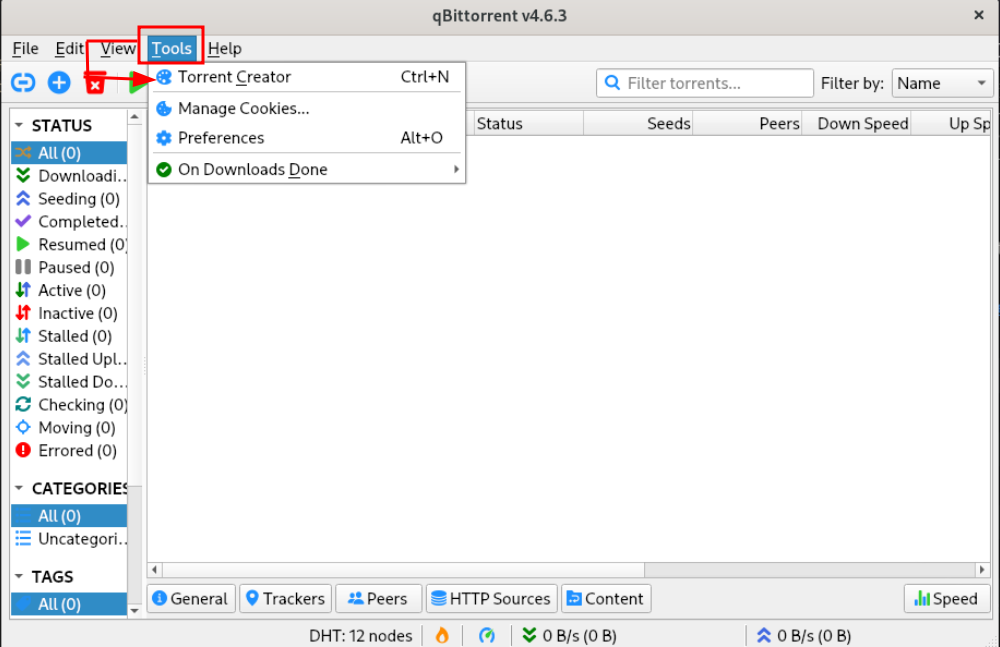
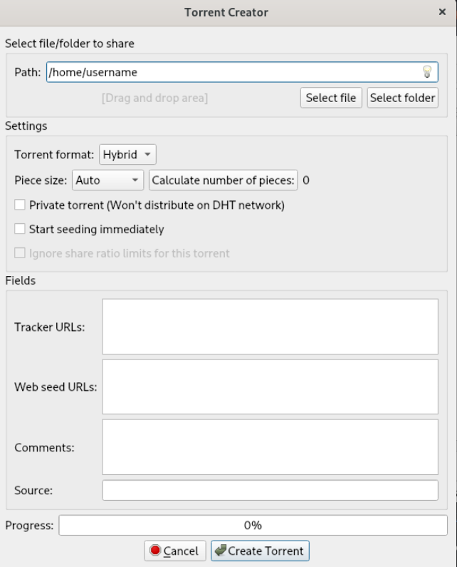

# BitTorrent Guide

## Introduction to BitTorrent
BitTorrent is a peer-to-peer (P2P) file-sharing protocol used for distributing large amounts of data across the internet. It works by breaking down files into smaller chunks, allowing users to download and upload simultaneously from multiple sources, improving download speed and efficiency.

### Key Terms
- **Torrent File**: A small file that contains metadata about the files to be shared and the network locations of peers.
- **Seeder**: A user who has a complete file and shares it with others.
- **Leecher**: A user who is downloading the file but may or may not have it completely.
- **Swarm**: All the seeders and leechers connected for a specific torrent file.
- **Tracker**: A server that helps BitTorrent clients find peers.

## Setting Up BitTorrent

### 1. Download a BitTorrent Client
To start using BitTorrent, download a client, such as:
- [qBittorrent](https://www.qbittorrent.org/)
- [uTorrent](https://www.utorrent.com/)
- [Transmission](https://transmissionbt.com/)

Choose one that suits your operating system (Windows, macOS, Linux).

### 2. Install the Client
Run the downloaded file and follow the installation instructions. Be sure to avoid optional adware or bundled software if prompted.

## Downloading Torrents

### Step 1: Find a Reliable Torrent Source
- Use legitimate torrent sites like [Public Domain Torrents](http://www.publicdomaintorrents.info/) or [Internet Archive](https://archive.org/) for free, legal content.
- Avoid suspicious or unauthorized sources to prevent downloading malicious content.

### Step 2: Download a Torrent File or Magnet Link
- **Torrent File**: Download the `.torrent` file and open it in your client.
- **Magnet Link**: Some sites provide magnet links. Click the link, and your BitTorrent client should open automatically.

### Step 3: Start the Download
Once added to your client, the download should begin immediately. You’ll see the progress in percentage, along with details about seeders, leechers, and download/upload speeds.

## Uploading/Seeding Torrents
After downloading a file, keep your torrent client open to "seed" the file. This helps others download and keeps the torrent alive.

## Tips for Using BitTorrent Safely and Efficiently

### Use a VPN
BitTorrent traffic is usually not encrypted, so it’s wise to use a VPN (Virtual Private Network) for privacy. A VPN hides your IP address and encrypts your connection, adding a layer of security.

### Configure Client Settings
- **Limit Upload/Download Speeds**: Go to your client settings to control speeds and prevent internet lag.
- **Set Download Location**: Specify a folder where all torrents will be saved.

### Avoid Suspicious Files
Avoid torrents with very few seeders, unknown formats, or suspicious file names (like `.exe` files disguised as movies or games).

## Frequently Asked Questions

### Is BitTorrent Legal?
Yes, BitTorrent as a protocol is legal. However, sharing copyrighted material without permission may violate local laws.

### What’s the Difference Between a Torrent and a Magnet Link?
A torrent file contains metadata about the files, while a magnet link uses a unique identifier to fetch the metadata directly from peers in the network.

### What Happens if I Don’t Seed?
When you don’t seed, you limit the availability of the file for others. Although seeding is not mandatory, it's encouraged as a way of giving back to the community.

---

# BitTorrent Protocol

- Bittorrent has an advantage over HTTP is that files are downloaded concurrently , the downloaders are also uploading chunks of the file. This allows for multiple downloads to occur with only a slight increase in load 

## How do peers upload to each other ? 


## Distribution 


### Web server 


#### 1. What is the web server for ? What content is hosted there ? 


#### 2. How do I configure apache to associate the .torrent extension with mimetype application/x-bittorrent ?

#### 2.1 What are mimetypes and how do they pertain to the \*.torrent file ? 

- MIME-types or Multipurpose Internet Mail Extensions types are identifiers used to tell the web server the format and data of a file. In the context of torrenting , the "application/x-bittorrent" MIME-Type is used to tell the web server how to interpret the file format.

#### 3. Where do I put the metainfo file on the web server 

#### 4. Why do I need a tracker and a web server ? 


### static metainfo file 


#### 1. How is this file used ?

- This file contains the complete file to be served and the URL of the tracker being used. Metainfo files commonly use the \*.torrent file extension. This file is then hosted on the web server. 


#### 2. Are there any tools I can use to automatically generate this file for me ? 

Yes , some clients have the functionality to generate the metainfo file for you. I will list some below and the steps to accomplish this. 

- qBittorrent, Deluge
    * In the client , navigate to Tools > Torrent Creator 



    * After that , fill out the information for Trackers , Web Seed URL's , Path where the \*.torrent file will be stored , and the Source files you would like to seed.  



- CLI Utilities : mktorrent


- Python , Libtorrent 

    - Download bencode.py 
    ```bash
    pip install bencode.py
    ```
    > Note : If you encounter an issue with importing the library , specifically this error 
    > ```bash
    > ModuleNotFoundError: No module named 'BTL'
    > ```
    > The current PyPi package does not actually install the required 'bencode.py' file. To fix this make sure to run the command 
    > as shown above with the \*.py extension included
    


#### 3. What does an example torrent file look like 

I downloaded the torrent file for Debian 12. Upon opening the file in a text editor , ( for this i'm using Vim ) at the very top I see a few UDP links to trackers the torrent would use. 

* Metainfo files are giant bencoded dictionaries 


```
```


### BitTorrent Tracker 


#### 1. How do trackers facilitate connections between peers who want to download the same file ? 

#### 2. How can I setup my own tracker ?


### 'original' downloader 


#### 1. How can I start my own torrent and allow peers to download

- I should have a tracker running 
- I should also have a web server such as apache 
- I should configure apache to associate the .torrent extension with mimetype application/x-bittorrent 
- I need to generate a metainfo file ( .torrent ) file for the torrent and include the torrent trackers and complete file  
- I need to add the metainfo (\*.torrent ) file to the web server. 
- I then need to supply a link to this file on an external website 
- I then need to start a downloader which has the complete file 

##### Summary 

In order to start hosting a file in BitTorrent. You essentially need a web server with the \*.torrent file which will need to be associated with a mimetype x/

#### 2. What downloaders can I use to distribute the file ? 


### End user web browsers

### End user downloaders

#### How does a host download a torrent ? 

- Install a BitTorrent client 
- search the web for a link to a \*.torrent file 
- select where to save the torrent file. 
- wait for the download to complete 
- After downloading the torrent may begin seeding. Seeding is NOT mandatory , however it serves the primary function of BitTorrent which allows other peers to share chunks of the downloaded file to other peers. There must be at least one peer that has the torrent fully downloaded and seeding to distribute the file. 

---

# How to host your own torrent using docker containers 

## Web Server 

You will need to have a web server to host the \*.torrent file. For this project , i'm going to use the supplied Apache docker container. 

- Pull docker container from Dockerhub 
    ```bash 
    docker pull httpd
    ```

- Run Docker container ( Without Dockerfile )
    ```bash
    docker run -dit --name torrent-webserver -p 8080:80 -v "$PWD":/usr/local/apache2/htdocs/ httpd:2.4
    ```
    > **Note:All HTML files from /usr/local/apache2/htdocs will be mounted as a volume within the containers filesystem**

- Run Docker container ( With Dockerfile )

    1. Create the following Dockerfile using your preferred editor in the folder of your project diretory 
        ```bash
        FROM httpd:2.4
        COPY ./public-html/ /usr/local/apache2/htdocs/
        ```

    > The './publc-html/' is a relative pathname to the directory which contains all HTML files to be added to your site

    2. Build the container using the Dockerfile 
        ```bash
        docker build -t my-server-image-name . 

        docker run -dit --name my-container-name -p 8080:80 my-server-image-name
        ```
    3. Verify the container is running 

        You can use curl to verify if the web server will respond 

        ```bash
        curl -v http://localhost:8080
        ```
        
- Associate \*.torrent with mimetype application  


